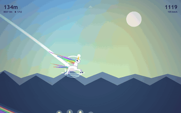

# ROLLERBOW

A ragdoll unicorn hurtles down a rainbow track. Entry for **js13kGames 2026**, theme "Unicorns and Rainbows".



This GIF is not a screen recording: the game is **driven**. `Math.random` is replaced by a seeded generator and `requestAnimationFrame` is taken over, so the frame rate is steady and two captures produce the same file. The driver is in `tools/autopilot.js`.

Everything fits in a single HTML file under 13,312 bytes once zipped: no framework, no image, no sound file. The scenery, the track, the unicorn and the music are generated in code.

## Play

Open `src/index.html` in a browser: the game there is self-contained and readable.
`dist/js13k/index.html` is the same page, compressed, the one the zip contains.

| action | keyboard | touch |
|---|---|---|
| raise the front leg, backflip | ← or A or Q | left half |
| raise the back leg, frontflip | → or D | right half |
| jump, on the ground as in the air | short press on both | tap on both halves |
| tuck | hold both, or ↓ | hold both halves |
| mute the music | M | |
| turn off the blood | G | |

The backflip makes you climb and brakes, the frontflip makes you dive and accelerates. The jump only rearms on contact with the ground.

## Build

```bash
npm install
./build.sh                    # builds src/index.html
./build.sh --best 6           # 6 roadroller draws, keeps the smallest
```

The chain extracts the `<script>`, runs it through **terser** then **roadroller**, rebuilds a minimal HTML, zips at `-9` then recompresses the container with **advzip** (zopfli). It fails if the 13,312-byte budget is exceeded, and only replaces the deliverables once the archive is verified.

Three outputs, from the same state of the source:

```
rollerbow.zip              contest archive, index.html at its root
dist/js13k/index.html      the page the zip contains, compressed
dist/wavedash/index.html   the same page without minification, for Wavedash
```

`roadroller` searches its parameters at random: two builds of the same source do not give the same byte count. Read the figure the build has just printed, never a figure written here. `--best 6` runs the draw six times and keeps the smallest.

### Why advzip and not `zip -9` alone

`zip -9` leaves room in the DEFLATE container. `advzip -z -4` recompresses the same content with zopfli: **353 bytes returned** on this game, more than the remaining headroom. The extracted file is identical bit for bit.

## Tests

The game has no dependency on a real browser: a simulated canvas is enough to run it under node. That makes it possible to measure what would be invisible to the eye.

```bash
node test/integrity.js src/index.html          # no NaN must reach the canvas
node test/controls.js  src/index.html          # the three control verbs
node test/hud.js       src/index.html          # no text overlap
node test/balance.js   src/index.html          # deaths, distance, speed over 8 tracks
node test/wavedash.js                          # achievements and leaderboards, source AND terser output
node test/build-smoke.js dist/js13k/index.html # the compressed BUILD, not the source
```

The last one is the most important: terser and roadroller can break perfectly valid code, and the compressed artifact is what gets submitted.

`test/wavedash.js` also runs on the **terser output**, and not only on the source. The reason is an expensive trap: `terser --compress booleans_as_integers` rewrites `true` as `1`, the Wavedash SDK validates its types and rejects the call, the defensive guard swallows the exception, and nothing gets sent any more, without a word in the console, from the build only. Its stubs therefore reproduce the type validation of the real SDK and **count** the violations instead of accepting everything. Verified: turning the option back on, the test lands on 14 violations and 0 achievements sent.

`test/integrity.js` deserves a word. A `NaN` passed to `fillRect`, or a color `hsl(NaN,...)`, raises no error: the browser silently ignores the call. The element disappears from the screen without the slightest message. This test catches those cases.

## The physics model

The physics comes from studying the source code of **Action SuperCross** (the predecessor of Elasto Mania), released by its authors. The model was reimplemented from scratch in JavaScript from an understanding of how it works, not transposed line by line.

What is carried over from it:

- three rigid bodies, a chassis and two skates, linked by stiff, over-damped elastic rods
- rolling contact at 0, 1 or 2 support points, with Huygens' theorem on the pivot
- fixed time step of 3 ms, spring at 10,000 N/m, damping at 1,000 N·s/m, mass ratio 20:1
- rotation is not a torque but a brief angular impulse of 12 rad/s, given back afterwards: that is what gives the original game its feel

What was added for an endless descent: aerodynamic drag, an air stabilizer, lift at flat pitch, landing damping, and asymmetric flips.

The Action SuperCross repository is *source-available*, not open source. None of its code is present here. Choose your own license for this project.

## Submission visuals

The form asks for a cover **800 × 500 px, PNG, ≤ 256 KB** and a thumbnail **320 × 320 px, PNG, ≤ 64 KB**, exact dimensions, mandatory format. Both are in `media/`. The uncompressed generator output they were derived from is kept on disk but out of the repository: recompressing an already quantized image stacks the losses, so a regenerated visual must start from that source, never from the committed PNG.

| file | dimensions | size | PSNR |
|---|---|---|---|
| `media/cover.png` | 800 × 500 | 162,105 B | 46.5 dB |
| `media/thumbnail.png` | 320 × 320 | 53,031 B | 46.6 dB |

## Structure

```
build.sh                     build chain
package.json                 terser + roadroller
src/index.html               readable, commented source
wavedash.toml                Wavedash challenge configuration
wavedash-achievements.json   achievement definitions, to import at the portal
dist/                        build output (js13k and wavedash)
test/                        harness and tests
tools/                       autopilot.js, the automatic driver used to record the gameplay GIF
media/                       submission cover and thumbnail
```

## Wavedash

The game enters the **Wavedash** challenge of the 2026 edition. The platform injects a `Wavedash` global before the game code; the game therefore loads **no external resource** and depends on no bundled SDK. Every call is guarded by `self.Wavedash`: off the platform, on js13kgames.com, the block is inert and the game behaves identically.

What is wired up, for **291 bytes** in the zip:

- `init()`, without which the game would stay hidden behind the platform loading screen
- `requestStats()`, without which no achievement would unlock, silently
- the **12 achievements** of the run, already shown in game by a homemade toast, so visible to js13k voters too
- two leaderboards, **distance** and **score**, sent only on a new local record

Achievement ids are derived from the displayed titles (`ACHT`): `FIRST FLIP` becomes `RB_FIRST_FLIP`. Renaming a title therefore renames its achievement, and forces its definition to be updated at the Developer Portal. `test/wavedash.js` checks that the ids in the code and those in `wavedash-achievements.json` match exactly.
